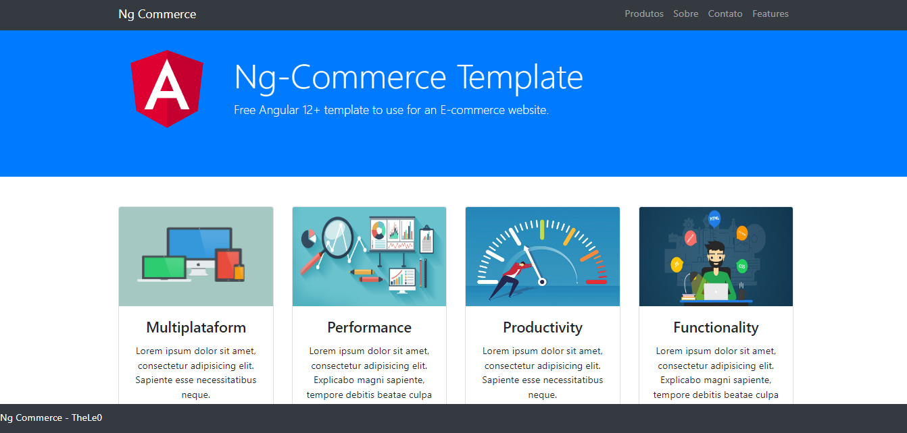
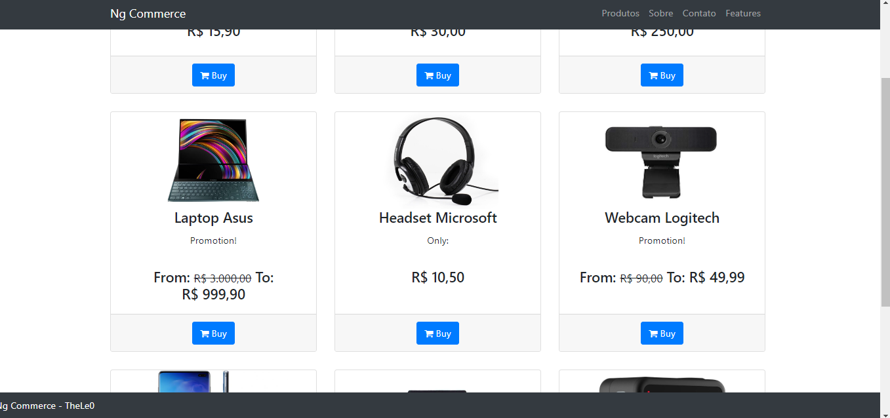
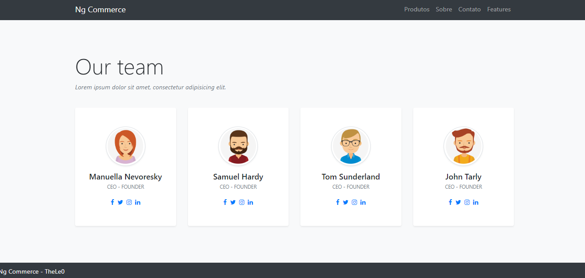
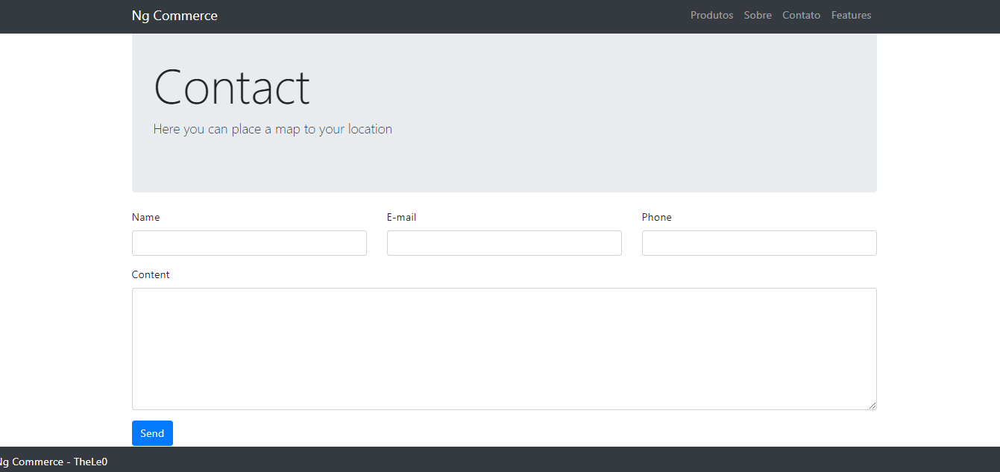

# NgCommerce

[](https://github.com/TheLe0/ng-commerce/actions/workflows/build_and_test.yml)

This is a free template for an E-Commerce website using Angular 12+.

To run locally on your machine you need to have installed:

* [Node 16+](https://nodejs.org/en/);
* [Json Server](https://www.npmjs.com/package/json-server);
* [Angular CLI](https://www.npmjs.com/package/@angular/cli).

>Note: To run the application you only need Node installed. You only need Json Server instlled
> if you want to run the application with the fake backend. And Angular CLI if you want to improve
> with new Angular functionalities.

## Setup the enviroment

To install and run the application you only need these commands:

```sh
npm i
json-server --watch ./data/products.json # If you want the fake backend, otherwise you can skip this step
npm start
```
Or you can run this on Docker, you only need to have installed on your machine Docker, don't need Node or Angular CLI. 
You can run on docker with this command:

```sh
docker-compose up -d
```

You are ready to go!

## Website Overview

<b>Home Page</b>:



<b>Products Page</b>:



<b>About Page</b>:



<b>Contact Page</b>:


